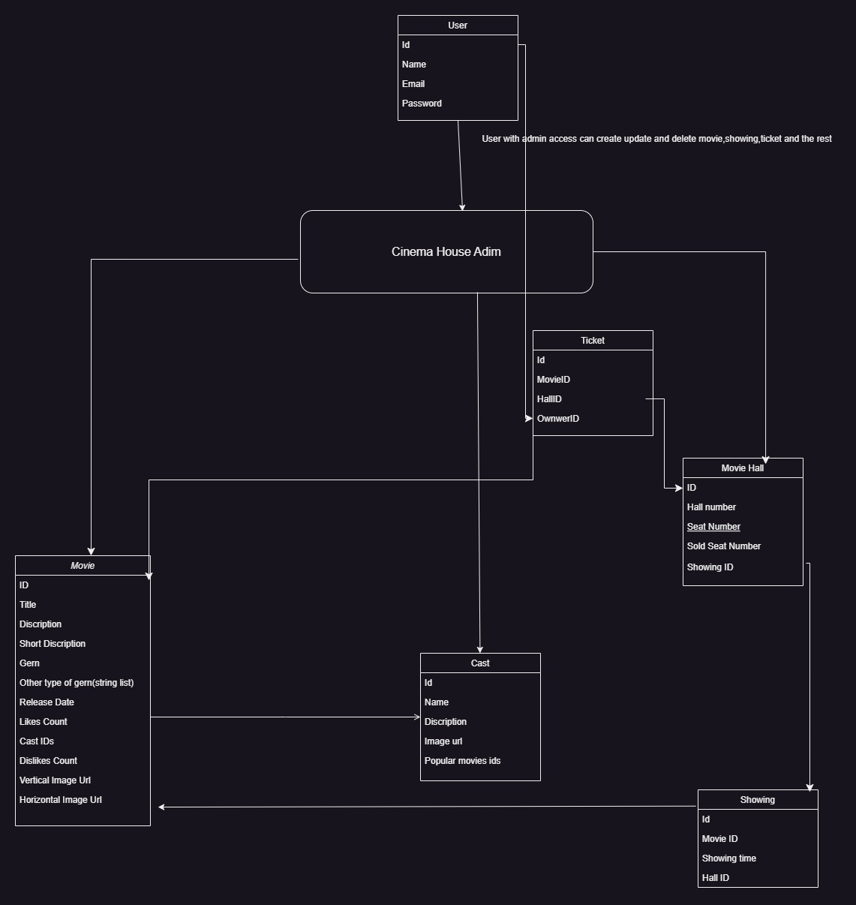

# Cinema House

A Spring boot project for cinema house management system

### Features

- User/Admin management system
- Movie management system
- Movies to be shown by what time and hall management system
- Hall management system
- Movie cast management system
- Ticket sales and verification management system

### System design
Below is a diagram representation of system and classes i came up with and implemented

Please note that the classes are missing some parameter(s) as i already created the image before i faced some challenges where i had to add parameter(s) and too lazy to redraw image

#

#f03c15 text

